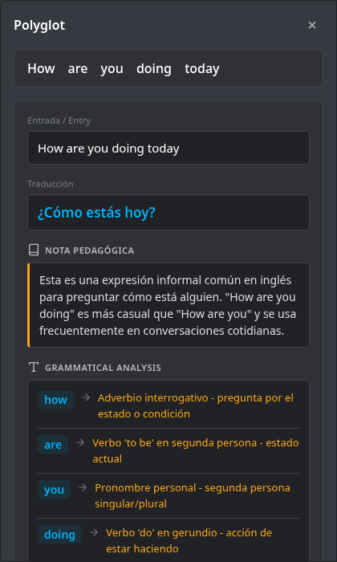
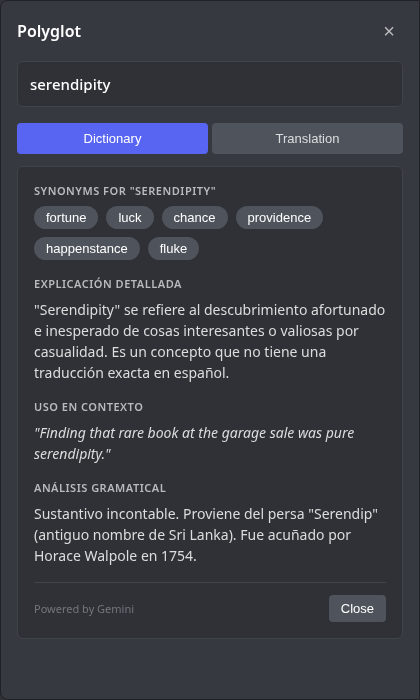

# Polyglot

A Vencord plugin for educational language learning. Select text in Discord to get instant translations, grammatical analysis, synonyms, and definitions powered by Gemini AI.




## Features

- **Instant Translation** — Select any text in Discord and get accurate translations with Gemini AI
- **Grammatical Analysis** — Word-by-word breakdown with grammatical functions in your native language
- **Dictionary Mode** — Click individual words for synonyms, definitions, and usage examples
- **Pedagogical Notes** — Contextual explanations for phrases and idiomatic expressions
- **Alternative Expressions** — Discover different ways to say the same thing
- **Side Panel UI** — Non-intrusive full-height panel on the right side of Discord
- **Multi-language Support** — Learn English, Spanish, French, German, Portuguese, and more

## Quick Start

### Prerequisites

- [Vencord](https://github.com/Vencord/Vencord) installed
- A [Gemini API key](https://aistudio.google.com/app/apikey) from Google AI Studio

### Installation

1. Clone the plugin into your Vencord userplugins directory:

   ```bash
   cd ~/.config/Vencord/src/userplugins/
   git clone https://github.com/MoriNo23/polyglot-vencord.git polyglot
   ```

2. Build Vencord:

   ```bash
   cd ~/.config/Vencord
   pnpm build
   ```

3. Restart Discord completely.

### Configuration

1. Open Discord Settings → **Vencord** → **Plugins**
2. Enable **Polyglot** and click the settings icon
3. Enter your **Gemini API Key**
4. Configure your learning and native languages

## Usage

### Phrase Translation

1. Select any text in a Discord message
2. Click the globe icon that appears near your selection
3. The side panel opens with translation, grammatical analysis, and notes

### Word Dictionary

1. Select a single word
2. Click the globe icon
3. Switch between **Dictionary** (synonyms + definitions) and **Translation** tabs
4. Click individual words in the phrase to look them up individually

### Quick Open

Click the floating globe button in the bottom-right corner to open the panel without selecting text.

## Settings

| Setting | Description | Default |
|---------|-------------|---------|
| Gemini API Key | Required for all AI features | *(empty)* |
| Learning Language | Source language for translations | English |
| Native Language | Language for explanations | Spanish |
| Gemini Model | AI model to use | Gemini 2.5 Flash |
| Enable Synonyms | Show synonym suggestions | Yes |
| Enable Translation | Enable translation feature | Yes |
| Enable Definitions | Show word definitions | Yes |
| Cache Results | Cache API responses for performance | Yes |

## Available Models

| Model | Speed | Quality | Best For |
|-------|-------|---------|----------|
| Gemini 2.5 Flash | Fast | Good | Everyday use (recommended) |
| Gemini 2.5 Flash-Lite | Fastest | Standard | Quick translations |
| Gemini 2.5 Pro | Moderate | Best | Complex grammatical analysis |

## Supported Languages

English, Spanish, Portuguese, French, German, Italian, Russian, Japanese, Korean, Chinese, Arabic

## Project Structure

```
polyglot/
├── index.tsx              # Plugin entry point
├── native.ts              # Electron IPC for API requests
├── styles.css             # Component styling
├── src/
│   ├── components/        # React UI components
│   │   ├── PopupCard.tsx      # Side panel container
│   │   ├── TranslationTab.tsx # Translation view
│   │   ├── SynonymsTab.tsx    # Dictionary/synonyms view
│   │   ├── DefinitionsTab.tsx # Word definitions
│   │   └── WordSegment.tsx    # Clickable word segments
│   ├── services/gemini/   # Gemini API integration
│   │   ├── client.ts          # API client & utilities
│   │   ├── translation.ts     # Translation prompts
│   │   ├── synonyms.ts        # Synonym prompts
│   │   ├── definition.ts      # Definition prompts
│   │   ├── types.ts           # TypeScript interfaces
│   │   └── index.ts           # Exports
│   ├── utils/             # Shared utilities
│   │   ├── selection.ts       # Text selection logic
│   │   ├── cache.ts           # Response caching
│   │   └── messages.ts        # Message helpers
│   └── settings.tsx       # Plugin settings UI
└── update-plugin.sh       # Deployment script
```

## Development

### Local Setup

```bash
git clone https://github.com/MoriNo23/polyglot-vencord.git
cd polyglot-vencord
./update-plugin.sh
cd ~/.config/Vencord && pnpm build
```

### Making Changes

1. Edit files in the `src/` directory
2. Run `./update-plugin.sh` to copy files to the Vencord plugins directory
3. Run `pnpm build` in the Vencord directory
4. Restart Discord or reload with `Ctrl+R`

## Security

- API keys are stored in Vencord's encrypted settings storage
- API requests are made through Electron's IPC (not exposed to renderer)
- No keys are logged or transmitted outside of API calls
- Response caching stores only results, never credentials

## Troubleshooting

| Issue | Solution |
|-------|----------|
| Plugin doesn't appear | Run `pnpm build` and restart Discord |
| Translation fails | Verify your Gemini API key in settings |
| No results | Check your internet connection |
| Model not found | Select a different model in settings |
| Panel won't close | Press `Esc` or click the × button |

## Contributing

Contributions are welcome! Areas where help is needed:

- **New languages** — Add support for additional language pairs
- **UI improvements** — Enhance the visual design and accessibility
- **Performance** — Optimize API calls and caching strategies
- **Bug fixes** — Address reported issues
- **Documentation** — Improve guides and add examples

1. Fork the repository
2. Create a feature branch (`git checkout -b feature/my-feature`)
3. Commit your changes (`git commit -m 'feat: add my feature'`)
4. Push to the branch (`git push origin feature/my-feature`)
5. Open a Pull Request

## Credits

- [Vencord](https://github.com/Vencord/Vencord) — Discord client modification framework
- [Gemini API](https://ai.google.dev/) — Google's AI model for translations and analysis

## License

Educational purposes. Use responsibly and respect API rate limits.
