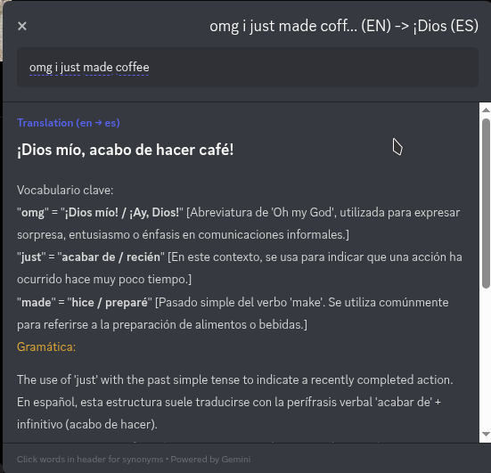
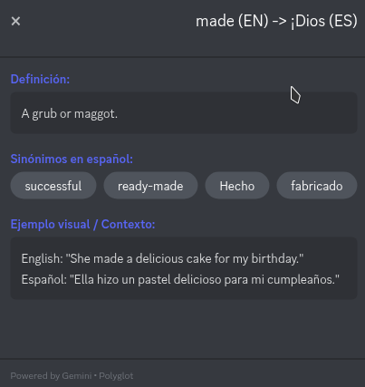
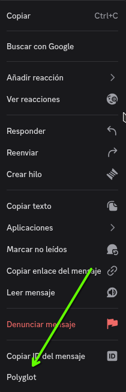

# Polyglot Plugin for Vencord

A Vencord plugin that provides educational language learning features directly in Discord. Get translations, synonyms, and definitions when selecting text.

## Screenshots





## Features

- **Translation**: Translate text from your learning language to your native language using Gemini API
- **Synonyms**: Get Spanish synonyms for English words (or vice versa)
- **Definitions**: Enhanced definitions using Gemini API
- **Educational Focus**: Perfect for language learners - shows grammar explanations, vocabulary pairs, and examples
- **Configurable**: Customize languages, API keys, and display preferences

## Installation

### Prerequisites
- [Vencord](https://github.com/Vencord/Vencord) installed
- [Gemini API key](https://makersuite.google.com/app/apikey) (required for translation and enhanced features)

### Steps

1. **Clone the repository**:
   ```bash
   cd ~/.config/Vencord/src/userplugins/
   git clone https://github.com/YOUR_USERNAME/polyglot-vencord.git
   ```

2. **Install dependencies** (if needed):
   ```bash
   cd ~/.config/Vencord
   pnpm install
   ```

3. **Build Vencord**:
   ```bash
   cd ~/.config/Vencord
   pnpm build
   ```

4. **Restart Discord** to load the plugin.

## Configuration

After installation, configure the plugin in Discord:

1. Open Discord Settings (⚙️)
2. Navigate to **Vencord** → **Plugins**
3. Find **Polyglot** and enable it
4. Click on the settings icon (⚙️) next to Polyglot

### Settings Available

- **Gemini API Key**: Required for translation and enhanced features
- **DeepL API Key**: Optional fallback for translation
- **Learning Language**: The language you're learning (default: English)
- **Native Language**: Your native language for explanations (default: Spanish)
- **Show Synonym Definitions**: Toggle definitions for synonyms
- **Primary Translation Service**: Choose between Gemini or DeepL

## Usage

1. **Right-click any message** in Discord
2. Select **Polyglot** from the context menu
3. A popup will appear with:
   - Translation of the text
   - Definitions
   - Synonyms (clickable words in the header)
   - Examples and context

### Viewing Synonyms

- In the translation view, **click any word** in the header
- A detailed view will appear showing:
  - Translation of the word
  - Definition
  - Spanish synonyms
  - Example sentences

## API Keys

### Gemini API (Recommended)
1. Go to [Google AI Studio](https://makersuite.google.com/app/apikey)
2. Create a new API key
3. Copy the key to the plugin settings

### DeepL API (Optional)
1. Go to [DeepL API Free](https://www.deepl.com/pro-api?cta=header-free-api)
2. Sign up for a free account
3. Copy the API key to the plugin settings

## Language Support

Currently supported languages:
- English (en)
- Español (es)
- Português (pt)
- Français (fr)
- Deutsch (de)

## Example

When you select "The new patch will enhance the system performance." and right-click:

```
Enhance (EN) -> Mejorar (ES)

Definición:
Aumentar o mejorar aún más la calidad, el valor o la eficiencia de un proceso o sistema.

Sinónimos en español:
[ Perfeccionar ] [ Optimizar ] [ Afinar ] [ Potenciar ]

Ejemplo visual / Contexto:
EN: "The new patch will enhance the system performance."
ES: "El nuevo parche mejorará el rendimiento del sistema."
```

## Troubleshooting

### Plugin doesn't appear
- Make sure you've built Vencord with `pnpm build`
- Restart Discord completely
- Check the console for errors (Ctrl+Shift+I)

### Translation fails
- Verify your Gemini API key is correct
- Check your internet connection
- Ensure you haven't exceeded API rate limits

### No synonyms appear
- Some words may not have synonyms available
- Try a different word
- Check if Gemini API is working

## Development

### Project Structure
```
polyglot/
├── index.tsx           # Main plugin logic
├── native.ts           # Native helpers for API requests
├── settings.tsx        # Plugin settings UI
├── styles.css          # Styling
├── components/         # UI components (optional)
├── services/           # API services
├── utils/              # Utility functions
└── README.md           # This file
```

### Building
```bash
cd ~/.config/Vencord
pnpm build
```

### Contributing
1. Fork the repository
2. Create a feature branch
3. Make your changes
4. Test thoroughly
5. Submit a pull request

## Help Wanted

We're looking for contributors to help improve this project! Here are some areas where we need help:

### Ideas & Suggestions
- **Feature ideas**: What other language learning features would be useful?
- **UI/UX improvements**: How can we make the interface more intuitive?
- **Language support**: Help add support for more languages
- **API integrations**: Suggestions for better translation/synonym APIs

### Code Contributions
- **Bug fixes**: Help fix reported issues
- **Performance improvements**: Optimize API calls and caching
- **Testing**: Help test on different platforms and Discord versions
- **Documentation**: Improve README, add examples, translate docs

### How to Help
1. **Open an issue** with your idea or suggestion
2. **Comment on existing issues** if you have thoughts
3. **Submit a pull request** with your improvements
4. **Share feedback** on what works and what doesn't

We appreciate all contributions, whether it's code, ideas, bug reports, or just feedback!

## License

This project is for educational purposes. Use responsibly and respect API rate limits.

## Support

If you encounter issues:
1. Check the troubleshooting section
2. Open an issue on GitHub
3. Include error messages and steps to reproduce

## Credits

- [Vencord](https://github.com/Vencord/Vencord) - Discord client modification
- [Gemini API](https://ai.google.dev/) - Google's AI model
- [DeepL API](https://www.deepl.com/) - Translation service (optional)